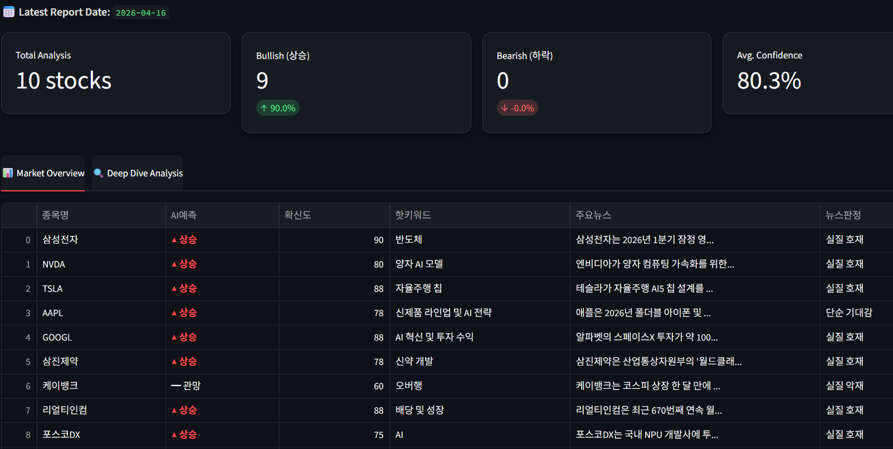
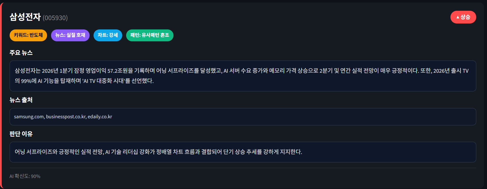
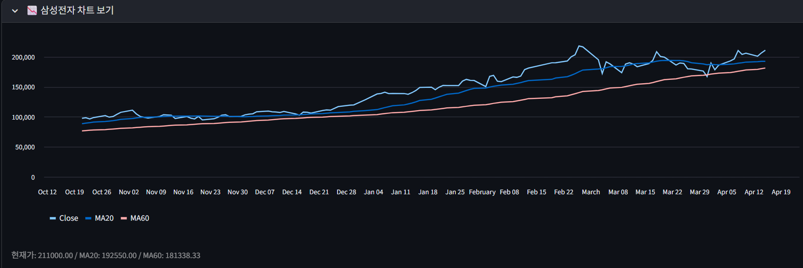

# 📈 Gemini 수석 애널리스트: AI 실시간 주식 전략 대시보드

> **"데이터로 기강 잡고, 수익으로 증명한다."** ㅡㅡ+

이 프로젝트는 **Google Gemini AI**와 **실시간 구글 검색 기능**을 결합하여,  
매일 아침 종목별 뉴스 재료와 기술적 지표(이동평균선)를 함께 분석하고  
단기 투자 판단을 정리하는 **AI 주식 분석 프로젝트**입니다.

현재 **3일차 개발 진행 중**이며,  
뉴스 수집 · 차트 분석 · Streamlit 대시보드 기능을 우선 구현한 상태입니다.

---

## 🚀 현재 구현 기능

### 1. AI 실시간 시장 분석
- Gemini 모델과 Google Search Tool을 연동하여 최신 뉴스 재료를 반영합니다.
- 종목별 핵심 키워드, 뉴스 요약, 뉴스 판정을 함께 저장합니다.

### 2. 기술적 지표 기반 판단
- 종가, 이동평균선(MA20, MA60) 등의 차트 정보를 활용해
  **상승 / 하락 / 관망**을 예측합니다.
- 차트 흐름과 뉴스 재료를 함께 반영하여 확신도를 산정합니다.

### 3. 데이터 자동 누적
- 매일 분석된 리포트를 `logs/daily_analysis_report.csv`에 저장합니다.
- 뉴스 요약, 뉴스 출처, 차트 판정, 패턴 판정 등도 함께 기록합니다.

### 4. 전용 대시보드 (Streamlit)
- 웹 화면에서 종목별 예측, 확신도, 뉴스 요약, 뉴스 출처, 핵심 사유를 확인할 수 있습니다.
- 상세 화면에서 종목별 차트도 함께 볼 수 있습니다.

---

## 🖼️ 예제 화면

### 1. 메인 대시보드
전체 종목의 예측 결과와 확신도를 한눈에 확인할 수 있는 화면입니다.  
상승 / 하락 / 관망 결과와 주요 뉴스 요약을 빠르게 훑어볼 수 있습니다.



### 2. 종목 상세 분석
선택한 종목의 뉴스 요약, 뉴스 출처, 차트 판정, 패턴 판정, 핵심 사유를 상세히 보여주는 화면입니다.  
AI가 왜 해당 종목을 상승 혹은 관망으로 판단했는지 근거를 확인할 수 있습니다.



### 3. 차트 보기
상세 화면에서 최근 주가 흐름과 이동평균선(MA20, MA60)을 함께 확인할 수 있는 차트 화면입니다.  
기술적 흐름을 직관적으로 파악할 수 있도록 구성했습니다.



---

## 🛠️ 기술 스택 (Tech Stack)

- **Language**: Python 3.10+
- **AI Model**: Google Gemini Flash 계열
- **Framework**: Streamlit
- **Data Handling**: Pandas
- **Environment**: python-dotenv
- **External Tool**: Google Search Tool

---

## 📂 프로젝트 구조

```text
Stock_Sentiment_Project/
├── images/
│   ├── dashboard_main.png
│   ├── detail_view.png
│   └── chart_view.png
├── src/
│   ├── main_auto.py      # 🚀 자동 분석 엔진
│   ├── web_app.py        # 📊 Streamlit 대시보드
│   └── evaluator.py      # 🎯 예측 결과 평가 / 성과 통합
├── run_pipeline.py       # 🔄 전체 파이프라인 실행 파일
├── logs/
│   ├── raw_data/         # 📦 종목별 원본 차트 데이터 (.csv)
│   ├── daily_analysis_report.csv   # 📈 일일 AI 분석 결과
│   └── total_performance.csv       # 🧾 통합 성과 기록
├── .env                  # 🔑 API 키 보관
├── requirements.txt      # 📚 필수 패키지 목록
└── README.md             # 📖 프로젝트 설명 문서
```

---

## ⚙️ 환경 변수 설정

프로젝트 루트 폴더에 `.env` 파일을 생성하고 본인의 API 키를 입력합니다.

```env
GOOGLE_API_KEY=your_google_api_key_here
```

---

## ▶️ 실행 방법

### 1. 전체 파이프라인 실행

```bash
# 가상환경 활성화 (Windows)
.\.venv\Scripts\activate

# 필수 패키지 설치
pip install -r requirements.txt

# 전체 실행
python run_pipeline.py
```

### 2. 개별 파이프라인 실행
```bash
# 주가 데이터 업데이트
python src/update_data.py

# AI 분석 리포트 생성
python src/main_auto.py

# 예측 결과 평가 / 통합
python src/evaluator.py

# 대시보드 실행
streamlit run src/web_app.py
```

---

## 📊 현재 저장 데이터 예시

현재 리포트에는 아래와 같은 정보가 누적됩니다.

- 날짜
- 종목명
- 티커
- AI예측
- 확신도
- 핫키워드
- 뉴스판정
- 뉴스요약
- 뉴스출처
- 패턴판정
- 차트판정
- 핵심사유

---

## 🚨 확신도 기준

현재 버전에서는 **뉴스 + 차트 + 패턴 요소**를 종합하여 확신도를 산정합니다.

- **90점 이상**: 뉴스와 차트 흐름이 매우 강하게 일치하는 구간
- **70~80점대**: 상승/하락 우세이나 일부 불확실성 존재
- **40~60점대**: 혼조세 또는 관망 구간
- **40점 미만**: 약세 또는 불확실성이 큰 구간

---

## 🎯 프로젝트 목표

단순한 뉴스 요약을 넘어서  
**뉴스 + 차트 + 데이터 누적**을 결합한  
객관적인 투자 판단 보조 도구를 만드는 것이 목표입니다.

---

## 🔧 추가 예정 기능

- 예측 적중률 평가 자동화 고도화
- `total_performance.csv` 기반 성과 분석 정리
- 종목 선택 UX 개선
- 대시보드 시각화 확장
- 조건별 필터링 기능 강화

---

## 💡 유의 사항

본 프로그램의 분석 결과는 AI의 판단이며,  
모든 투자의 책임은 본인에게 있습니다.

이 프로젝트는 **투자 추천 서비스**가 아니라,  
뉴스와 차트 데이터를 정리하고 해석하는 **분석 보조 도구**를 목표로 개발 중입니다.
