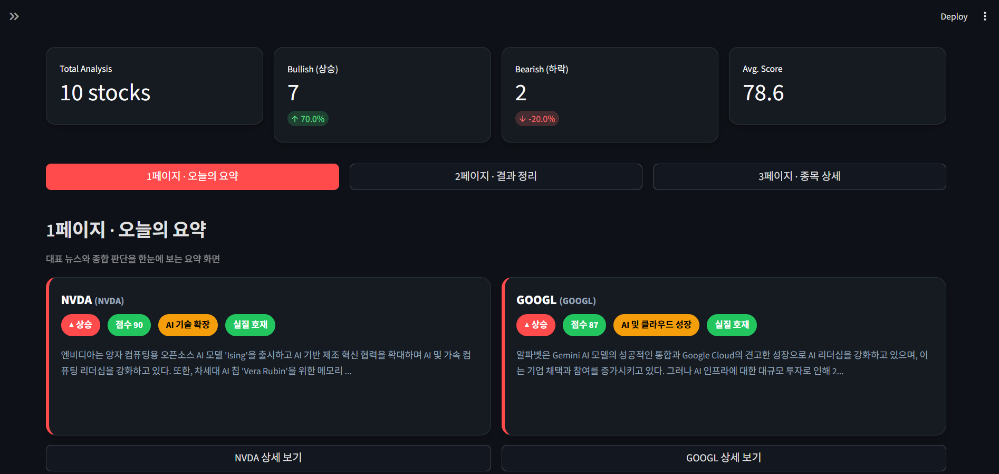
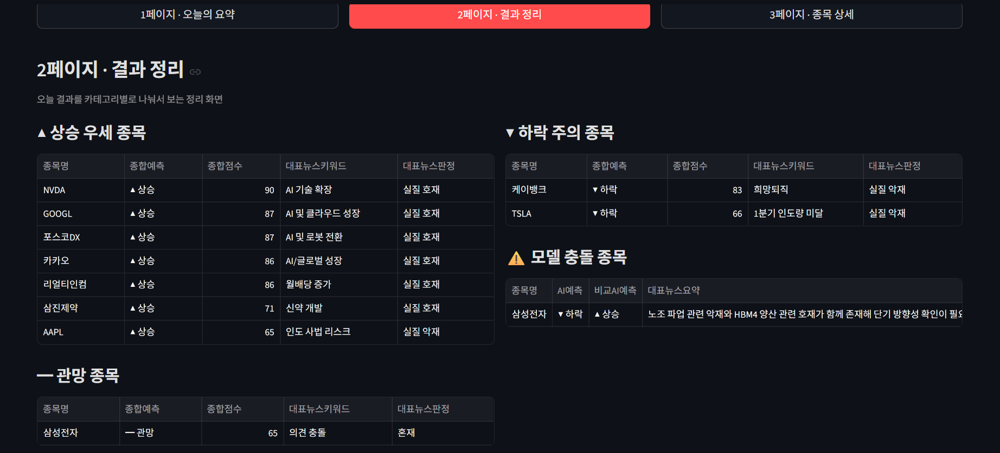
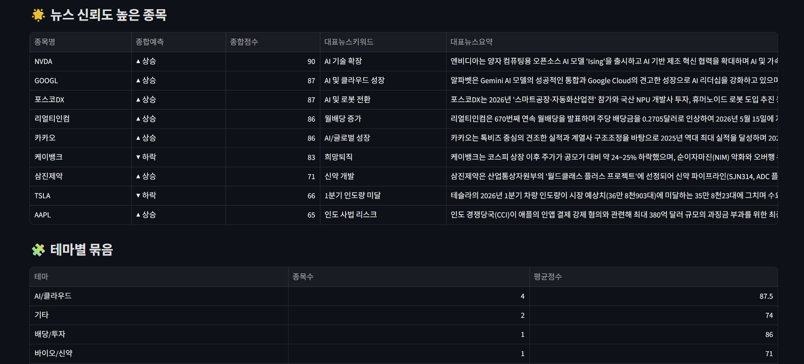
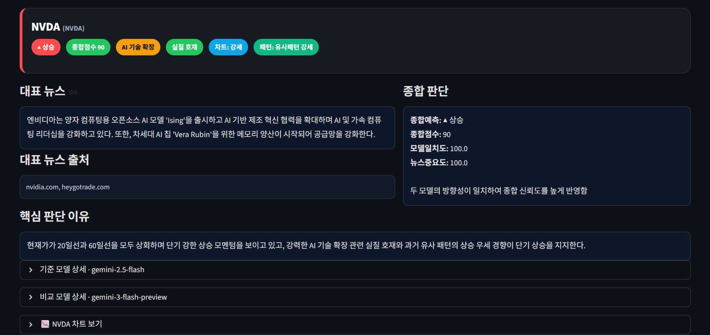

# 📈 Gemini 수석 애널리스트: AI 실시간 주식 전략 대시보드

> **"실시간 뉴스와 기술적 지표를 결합한 LLM 기반 주식 분석 시스템"**

## 👉 [라이브 데모 바로 보기](https://stock-sentiment-project.streamlit.app)

[](https://stock-sentiment-project.streamlit.app)

이 프로젝트는 **Google Gemini AI**와 **실시간 구글 검색 기능**을 결합하여,  
종목별 **뉴스 재료 / 기술적 지표 / 과거 패턴**을 함께 해석하고  
단기 투자 판단을 정리하는 **AI 주식 분석 프로젝트**입니다.

단순한 뉴스 요약 도구가 아니라,  
**주가 데이터 수집 → 뉴스 분석 → LLM 종합 판단 → 결과 누적 저장 → 과거 백필 → 성과 평가**까지  
하나의 흐름으로 연결한 구조를 목표로 개발하고 있습니다.

현재는 10개 종목을 기준으로 테스트 중이며,  
**오늘용 자동 분석 파일**과 **과거 데이터 백필 전용 파일**을 분리하여  
실시간 분석과 과거 검증 흐름을 나누어 관리하고 있습니다.

또한 최근에는 Streamlit 대시보드를 **3단 구조**로 재구성했습니다.

- **1페이지 · 오늘의 요약**: 대표 뉴스와 종합 판단을 빠르게 훑어보는 메인 화면
- **2페이지 · 결과 정리**: 상승 우세 / 관망 / 하락 주의 / 모델 충돌 종목을 카테고리별로 정리하는 화면
- **3페이지 · 종목 상세**: 대표 뉴스, 종합 판단, 차트, 기준/비교 모델 상세를 깊게 확인하는 화면

---

## 💭 Why I Built This

이 프로젝트는 단순히 주가 데이터를 분석하는 실습용 프로젝트가 아닙니다.

가까운 사람이 반복적으로 손실을 보는 모습을 보며,  
막연한 감각이나 분위기에 의존하는 투자 판단보다  
뉴스, 차트, 과거 데이터에 근거한 분석 흐름이 필요하다고 느꼈습니다.

동시에 저 역시 지난 시간을 헛되게 흘려보내지 않고,  
지금 배우고 있는 기술을 실제 문제를 해석하고 구조화하는 데 연결해보고 싶었습니다.

그래서 이 프로젝트는  
**누군가의 반복되는 손실을 줄이기 위한 시도이자,  
제가 배운 것을 실제 의미 있는 결과물로 남기기 위한 프로젝트**입니다.

---

## 🚀 프로젝트 개요

이 프로젝트의 핵심은 **Gemini가 LLM 기반 애널리스트 역할**을 수행한다는 점입니다.

시스템은 종목별로 다음 정보를 수집합니다.

- 최신 뉴스 재료
- 차트 흐름 (종가, 이동평균선, 거래량 등)
- 과거 예측 로그 및 패턴

이후 Gemini가 이 정보를 종합하여  
**상승 / 하락 / 관망** 중 하나의 방향성과 확신도를 생성합니다.

현재 단계에서는 **직접 학습한 머신러닝 모델이 예측하는 구조는 아니며**,  
LLM이 뉴스와 차트 데이터를 해석할 수 있도록 **데이터 파이프라인과 분석 구조를 설계한 상태**입니다.

향후에는 누적된 예측 로그를 기반으로  
**별도의 머신러닝 모델을 학습시켜 Gemini 분석 결과와 비교하는 2중 검증 구조**로 확장할 계획입니다.

---

## 🧠 현재 분석 구조

### 1. 뉴스 분석
- Google Search Tool을 활용해 종목 관련 최신 뉴스를 수집합니다.
- Gemini가 핵심 키워드, 뉴스 요약, 뉴스 성격(실질 호재 / 실질 악재 / 단순 기대감)을 정리합니다.

### 2. 차트 분석
- 종가, 이동평균선(MA20, MA60), 거래량 등 기술적 지표를 기반으로 현재 흐름을 해석합니다.
- 차트 흐름은 **강세 / 약세 / 혼조** 형태로 반영됩니다.

### 3. 과거 패턴 참고
- 기존 예측 로그를 누적 저장하고, 종목별 과거 예측 성향과 적중 여부를 참고합니다.
- 이를 통해 단순한 하루치 분석이 아니라 **누적 맥락 기반 판단**을 시도합니다.

### 4. 최종 LLM 판단
Gemini는 위 세 가지 정보를 종합해 다음 항목을 생성합니다.

- 기준모델
- AI예측
- 확신도
- 핫키워드
- 뉴스판정
- 뉴스요약
- 뉴스출처
- 패턴판정
- 차트판정
- 핵심사유

비교 모델을 설정한 경우에는 같은 종목을 두 모델로 분석한 뒤, 아래 항목을 추가로 저장합니다.

- 비교모델
- 비교AI예측
- 비교확신도
- 비교뉴스판정
- 비교뉴스요약
- 종합예측
- 종합점수
- 모델일치도
- 뉴스중요도
- 종합사유

---

## 🔄 현재 개발 흐름

현재 프로젝트는 크게 **오늘용 자동 분석**과 **과거 데이터 백필** 흐름으로 나뉘어 있습니다.

### 1. 오늘용 자동 분석 (`main_auto.py`)
- 당일 기준 최신 뉴스와 차트 데이터를 기반으로 종목별 분석 리포트를 생성합니다.
- 결과는 `logs/daily_analysis_report.csv`에 누적 저장됩니다.
- 즉, **"오늘 시장 기준으로 현재 종목을 어떻게 볼 것인가"** 에 초점을 둔 파일입니다.

### 2. 과거 데이터 백필 (`backfill_history.py`)
- 과거 날짜 기준으로 종목별 분석 로그를 생성합니다.
- 백필은 **거래일 기준으로만 실행**되며, 주말은 자동 스킵합니다.
- 이를 통해 향후 적중률 평가, 성과 분석, ML 학습용 데이터셋 구축에 활용할 수 있는 히스토리 로그를 만듭니다.

### 3. 성과 평가 (`evaluator.py`)
- 누적된 예측 로그를 바탕으로 실제 결과 및 성과를 정리합니다.
- 향후 적중률, 종목별 성과, 예측 유형별 성과 분석에 활용할 수 있도록 확장할 예정입니다.

---

## ⚙️ 3단계 자동화 파이프라인

이 프로젝트는 상위 실행 파일인 `run_pipeline.py`를 통해  
아래 3단계를 자동으로 연결하는 구조를 갖고 있습니다.

### 1단계. 주가 데이터 업데이트
- `update_data.py`
- 종목별 원본 차트 데이터를 갱신합니다.

### 2단계. AI 분석 리포트 생성
- `main_auto.py`
- 당일 뉴스 + 차트 + 과거 패턴을 종합하여 종목별 AI 분석 결과를 생성합니다.

### 3단계. 예측 결과 평가 / 통합
- `evaluator.py`
- 누적된 예측 결과를 평가하고 통합 성과 파일을 갱신합니다.

즉, `run_pipeline.py`는  
**데이터 갱신 → AI 분석 → 성과 평가 → 대시보드 실행**을 하나의 흐름으로 실행하는 상위 파이프라인 역할을 합니다.

---

## 🖼️ 예제 화면

### 1. 1페이지 · 오늘의 요약
대표 뉴스와 종합 판단을 카드 형태로 빠르게 확인하는 메인 화면입니다.  
종목별 **종합예측 / 종합점수 / 대표 키워드 / 대표 뉴스 요약**을 한눈에 볼 수 있도록 구성했습니다.



### 2. 2페이지 · 결과 정리 (상단)
오늘 분석 결과를 카테고리별로 정리하는 화면입니다.  
상승 우세 종목, 관망 종목, 하락 주의 종목, 모델 충돌 종목을 나누어 확인할 수 있습니다.



### 3. 2페이지 · 결과 정리 (하단)
뉴스 신뢰도가 높은 종목과 테마별 묶음을 추가로 확인하는 화면입니다.  
단순 표 나열이 아니라, **오늘 결과를 해석 가능한 구조**로 정리하는 데 초점을 맞췄습니다.



### 4. 3페이지 · 종목 상세
선택한 종목의 대표 뉴스, 종합 판단, 뉴스 출처, 핵심 판단 이유를 먼저 보여주고,  
기준 모델 / 비교 모델 상세와 차트는 접었다 펼칠 수 있도록 구성했습니다.



## 🛠️ 기술 스택 (Tech Stack)

- **Language**: Python 3.10+
- **AI Model**: Google Gemini 2.5 Flash
- **Framework**: Streamlit
- **Data Handling**: Pandas
- **Environment**: python-dotenv
- **API / Request**: requests
- **External Tool**: Google Search Tool

---

## 📂 프로젝트 구조

```text
Stock_Sentiment_Project/
├── images/
│   ├── overview_page.png
│   ├── summary_page_top.png
│   ├── summary_page_bottom.png
│   └── detail_page.png
├── src/
│   ├── backfill_history.py      # 🕰️ 과거 데이터 백필 전용 분석 파일
│   ├── evaluator.py             # 🎯 예측 결과 평가 / 성과 통합
│   ├── finance.py               # 💹 금융 데이터 처리 로직
│   ├── macro.py                 # 🛠️ 보조 실행 / 유틸 스크립트
│   ├── main_auto.py             # 🚀 오늘용 자동 분석 엔진
│   ├── update_data.py           # 📥 주가 데이터 업데이트
│   ├── visualize.py             # 📊 시각화 관련 스크립트
│   └── web_app.py               # 🌐 3페이지 구조 Streamlit 대시보드
├── run_pipeline.py              # 🔄 데이터 업데이트 → AI 분석 → 평가 → 대시보드 실행
├── logs/                        # 실행 시 생성되는 데이터 폴더 (Git 제외)
│   ├── raw_data/                # 📦 종목별 원본 차트 데이터 (.csv)
│   ├── daily_analysis_report.csv      # 📈 오늘용 AI 분석 결과
│   ├── backfill_analysis_report.csv   # 🕰️ 과거 백필 결과
│   └── total_performance.csv          # 🧾 통합 성과 기록
├── .env                         # 🔑 API 키 보관
├── requirements.txt             # 📚 필수 패키지 목록
└── README.md                    # 📖 프로젝트 설명 문서
```

---

## ⚙️ 환경 변수 설정

프로젝트 루트 폴더에 `.env` 파일을 생성하고 본인의 API 키를 입력합니다.

```env
GOOGLE_API_KEY=your_google_api_key_here
GEMINI_MODEL_NAME=gemini-2.5-flash
GEMINI_COMPARE_MODEL_NAME=
STOCK_INCLUDE=
STOCK_EXCLUDE=
```

`GEMINI_MODEL_NAME`을 바꾸면 Gemini 모델을 교체해 테스트할 수 있습니다.
예를 들어 최신 Flash 계열을 시험할 때는 Google AI Studio에서 사용 가능한 모델 코드를 확인한 뒤 이 값을 변경합니다.

두 모델을 동시에 비교하려면 `GEMINI_COMPARE_MODEL_NAME`에 비교할 모델 코드를 넣습니다.
예를 들어 기준 모델은 2.5 Flash로 두고, 비교 모델을 최신 Flash 계열로 시험할 수 있습니다.

```env
GEMINI_MODEL_NAME=gemini-2.5-flash
GEMINI_COMPARE_MODEL_NAME=gemini-3-flash-preview
```

비교 모델을 비워두면 기존처럼 기준 모델 하나만 실행합니다.

특정 종목만 돌리거나 잠시 제외하려면 쉼표로 구분해 입력합니다. 종목명 또는 티커를 사용할 수 있습니다.

```env
# 이 종목만 실행
STOCK_INCLUDE=NVDA,TSLA

# 이 종목은 제외하고 실행
STOCK_EXCLUDE=삼성전자,005930
```

`STOCK_INCLUDE`가 있으면 포함 목록이 우선 적용되고, 이후 `STOCK_EXCLUDE`에 적힌 종목은 제외됩니다.

---

## ▶️ 실행 방법

### 1. 전체 파이프라인 실행

```powershell
# 가상환경 활성화 (Windows)
.\.venv\Scripts\Activate.ps1

# 필수 패키지 설치
pip install -r requirements.txt

# 데이터 업데이트 → AI 분석 → 성과 평가 → 대시보드 실행
python run_pipeline.py
```

### 2. 개별 실행

```bash
# 주가 데이터 업데이트
python src/update_data.py

# 오늘용 AI 분석 리포트 생성
python src/main_auto.py

# 과거 데이터 백필
python src/backfill_history.py

# 예측 결과 평가 / 통합
python src/evaluator.py

# 대시보드 실행
streamlit run src/web_app.py
```

---

## 📊 현재 저장 데이터 예시

현재 리포트에는 아래와 같은 정보가 누적됩니다.

- 날짜
- 종목명
- 티커
- 기준모델
- AI예측
- 확신도
- 핫키워드
- 뉴스판정
- 뉴스요약
- 뉴스출처
- 패턴판정
- 차트판정
- 핵심사유

비교 모델을 켠 경우 아래 항목도 함께 저장됩니다.

- 비교모델
- 비교AI예측
- 비교확신도
- 비교핫키워드
- 비교뉴스판정
- 비교뉴스요약
- 비교뉴스출처
- 비교패턴판정
- 비교차트판정
- 비교핵심사유
- 종합예측
- 종합점수
- 모델일치도
- 뉴스중요도
- 종합사유

`evaluator.py` 실행 후 생성되는 `logs/total_performance.csv`에는 아래 평가 항목이 추가됩니다.

- 실제결과
- 적중여부
- 수익률
- 기준가
- 평가일
- 평가가
- 평가상태

---

## 🚨 확신도 기준

현재 버전에서는 **뉴스 + 차트 + 과거 패턴**을 종합하여 확신도를 산정합니다.

- **85~95**: 차트 / 뉴스 / 과거 패턴이 강하게 일치
- **70~84**: 우세 방향은 있으나 일부 불확실성 존재
- **55~69**: 혼조세, 관망에 가까운 구간
- **0~54**: 근거 부족 또는 신뢰 낮음

다만 현재 구조상 **5년치 차트 데이터가 항상 존재하기 때문에**,  
실제 운영에서는 `0~54` 구간보다 `55~69` 구간이 보수적 판단 영역으로 더 자주 사용됩니다.

또한 뉴스 수집 실패 시에는 재시도 로직을 적용하고,  
실패한 경우 확신도를 보수적으로 낮추도록 설계하고 있습니다.

---

## 📰 뉴스 반영 방식과 한계

현재 버전에서 뉴스 중요도는  
**이벤트별 정교한 가중치 방식은 아니며**, 두 모델의 뉴스판정이 실질 호재/악재로 일치하는지와 단순 기대감 여부를 반영한 후처리 점수로 계산합니다.

즉,
- A 뉴스가 B 뉴스보다 훨씬 중요하더라도
- 현재 구조에서는 실질 호재/악재 여부와 두 모델의 일치 여부를 우선 반영하며
- 실적, 규제, 소송, 배당 같은 이벤트 종류별 세부 가중치는 아직 적용하지 않았습니다.

### 향후 개선 예정
- 실적 / 가이던스 / 규제 / 소송 / 배당 / 신제품 출시 등 이벤트별 중요도 가중치 부여
- 복수 뉴스의 우선순위 정렬
- 뉴스 품질 필터링 및 저신뢰 출처 제외
- 뉴스 중요도와 차트 신호를 함께 반영한 후처리 규칙 추가

---

## 🎯 프로젝트 목표

이 프로젝트의 목표는 단순 뉴스 요약기가 아니라,

**뉴스 + 차트 + 누적 로그 + LLM 해석**을 결합한  
**주식 분석 보조 시스템**을 만드는 것입니다.

장기적으로는 아래와 같은 구조를 목표로 합니다.

1. Gemini 기반 실시간 분석
2. 예측 로그 누적
3. 과거 데이터 백필
4. 머신러닝 모델 학습
5. Gemini 분석 결과와 ML 결과 비교
6. 최종적으로 신뢰도 높은 2중 검증 구조 구축

---

## 🔧 추가 예정 기능

- 백필 데이터 정교화
- 뉴스 실패 / 품질 문제에 대한 후처리 고도화
- 예측 적중률 평가 자동화
- `total_performance.csv` 기반 성과 분석 정리
- 종목 선택 UX 개선
- 대시보드 시각화 확장
- 조건별 필터링 기능 강화
- 종목 마스터 파일(`stock_master.csv`) 기반 관리
- 뉴스 중요도 가중치 설계
- Gemini 분석 결과와 ML 모델 결과 비교 기능

---

## 💡 유의 사항

본 프로그램의 분석 결과는 AI의 판단이며,  
모든 투자의 책임은 본인에게 있습니다.

이 프로젝트는 **투자 추천 서비스**가 아니라,  
뉴스와 차트 데이터를 정리하고 해석하는 **AI 기반 분석 보조 도구**를 목표로 개발 중입니다.
